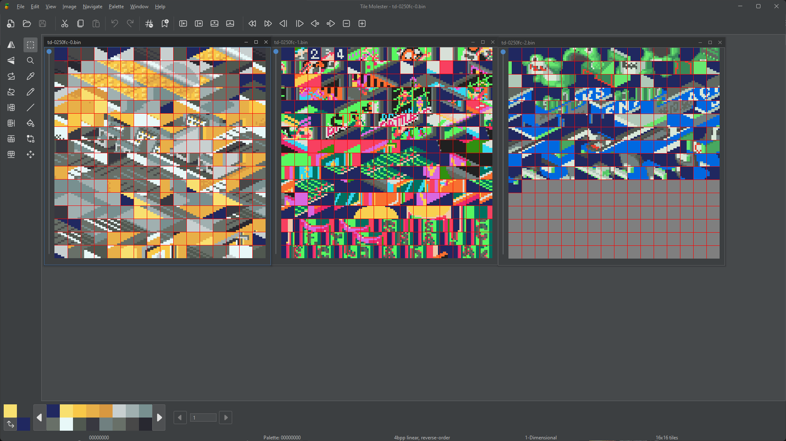

# mmbn-bg-graphic-previewer

Ferramenta criada por denim para editar gráficos de backgrounds dos jogos da série MegaMan Battle Network.

## Parte técnica

Cada um desses backgrounds está envolto em um contêiner com o seguinte formato:

- Cabeçalho: Contendo 9 DWORDs (ou 36 bytes) contendo seus metadados;
- Tilesets: Contendo 3 gráficos comprimidos em LZSS, compostos de vários tiles com os gráficos dos backgrounds;
- Tilemaps: Mapas de tiles usados para montar os gráficos.
- Paleta: 16 paletas de 16 cores cada, utilizadas combinadamente pelos tilesets.

Além disso, para cada contêiner, há um ou mais ponteiros absolutos apontando para eles. Os ponteiros apontam para o início do contêiner (primeiro byte do seu cabeçalho), e podem ter seus valores remanejados para caso queiramos inserir eles no final da rom. Isso é crucial porque na maioria das vezes nem dará pra reinserir os gráficos nos mesmos locais onde estão, devido às compressões, então é melhor expandir a rom de 8mb pra 16mb e reinserir esses gráficos na área livre da rom expandida.

A lógica de extração de gráficos de backgrounds por essa ferramenta já prevê que seja passado não o offset de um contêiner em si, mas sim o offset de um de seus ponteiros absolutos. Por exemplo, se um contêiner se situar no offset 0x44dce0, mas o offset de um de seus ponteiros for 0x0250fc, a extração deve ser feita não pelo offset do contêiner, mas sim pelo do ponteiro. Assim, sendo passando o offset do ponteiro, ela criará arquivos com essas nomenclaturas, dentro da pasta "data":

- header-0250fc.bin
- td-0250fc-0.bin
- td-0250fc-1.bin
- td-0250fc-2.bin
- tm-0250fc.bin
- pal-0250fc.bin

Já na inserção, a ferramenta apenas gera um único arquivo "img-0250fc.bin", que basicamente consiste de um contêiner totalmente remontado. Esse arquivo precisa ser manualmente inserido em uma área livre na ROM, bem como ter seus ponteiros alterados para apontar para o novo local. Foi feito dessa maneira para que a lógica de inserção e atualização de ponteiros possa ser feita com ARMIPS.

# Como a tool funciona

Para extrair os gráficos utilizando essa ferramenta, primeiramente você precisa dos offsets dos ponteiros absolutos apontando para os contêiners. O offset precisa ter os zeros à esquerda removidos, então se o offset é 0x0250fc, o último zero à esquerda precisa ser removido, resultando em `250fc`.

Tendo os offsets dos ponteiros em mãos, basta rodar o seguinte comando dentro dessa pasta:
```bat
unpacker.exe -ds -f "Mega Man Battle Network 3 - White Version (USA).gba" -p 250fc
```

Assumindo que o valor passado ao parâmetro `-p` seja de um ponteiro absoluto válido, a ferramenta deve gerar os arquivos modificados dentro da subpasta "data", conforme mencionados na seção anterior.

Ainda sobre extração, a ferramenta também conta com um parâmetro opcional `-o`, que é usado para especificar uma versão (white ou blue, por exemplo). Isso é bastante útil quando um offset de um ponteiro de gráfico (ex.: 0x0250fc) existe em múltiplas versões de uma rom, então para evitar que uns sobrescrevam os outros por acidente, passar o `-o` faz com que os nomes dos arquivos extraídos tenham um prefixo equivalente ao valor passado no parâmetro (ex.: blue-header-0250fc.bin)
```bat
unpacker.exe -ds -f "Mega Man Battle Network 3 - Blue Version (USA).gba" -p 250fc -o "blue"
```

Uma vez extraídos, os gráficos podem ser editados por qualquer editor de tiles, como por exemplo o [Tile Molester 0.21](https://www.romhacking.net/utilities/1583/). Aqui um exemplo, quando você abre os arquivos "td" e importa a paleta do arquivo "pal" (acesse a wiki do repositório para mais informações):



Já para remontar um contêiner baseado em arquivos previamente extraídos e editados, e tendo em mãos o offset do ponteiro (sem zeros à esquerda), basta rodar o seguinte comando dentro dessa pasta:
```bat
unpacker.exe -is -p 250fc
```

Se feito corretamente, a ferramenta deve gerar o arquivo do contêiner remontado, com o nome de "img-0250fc.bin". Daí em diante, você já pode inserir esse arquivo no final da rom, e remanejar seus ponteiros de acordo.

# Bugs menores

Q: Como faço para obter os offsets dos gráficos de backgrounds?

A: Veja [essa página da wiki](https://github.com/leomontenegro6/mmbn-bg-graphic-unpacker/wiki).

Q: Tentei extrair passando um offset específico, mas não funcionou. O que pode ser?

A: Se o offset for incorreto ou apontar pra um local que não é de um contêiner de backgrounds, é esperado que a ferramenta aborte sem exibir muitos detalhes de erro. Certifique-se de que o offset do ponteiro está correto.

Q: Consegui extrair um gráfico de background e abrir os tilesets por um editor de tile, mas ainda sim os tiles tão super bagunçados e isso torna a edição deles bem complicada. Não teria uma forma de já manter os tilesets organizados em função dos tilemaps, para que a edição dos BGs seja mais fácil?

A: No que tange à extração, o melhor que essa ferramenta, por si só, consegue chegar, é extrair contêiners para arquivos individuais de tilesets/tilemaps/paletas. Muito embora seja viável ter uma outra ferramenta que exiba os backgrounds de uma forma mais amigável, a prática mostrou que os jogos possuem muitas especificidades que torna esse processo bem trabalhoso. Dito isso, foi possível editar todos os gráficos de backgrounds do mmbn3 para uma tradução PT-BR, e o processo até que é doável com um certo esforço.

# Disclaimer

Embora esta ferramenta esteja aqui disponibilizada, ela foi fornecida as-is. O código-fonte dela não está disponível, e nenhum suporte será dado. Use-a por sua conta e risco.